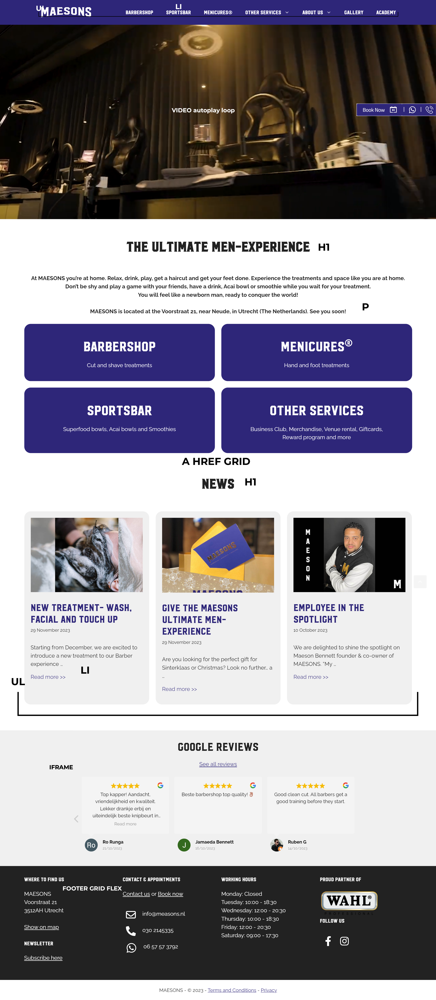
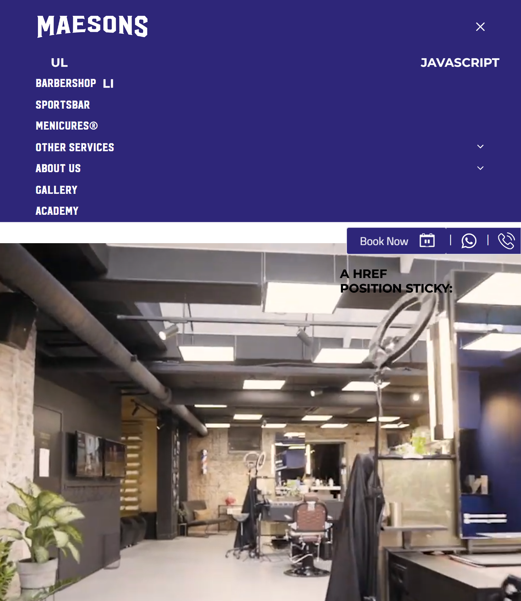

# Procesverslag
Markdown is een simpele manier om HTML te schrijven.  
Markdown cheat cheet: [Hulp bij het schrijven van Markdown](https://github.com/adam-p/markdown-here/wiki/Markdown-Cheatsheet).

Nb. De standaardstructuur en de spartaanse opmaak van de README.md zijn helemaal prima. Het gaat om de inhoud van je procesverslag. Besteedt de tijd voor pracht en praal aan je website.

Nb. Door *open* toe te voegen aan een *details* element kun je deze standaard open zetten. Fijn om dat steeds voor de relevante stuk(ken) te doen.

## Jij

  
uitwerken voor kick-off werkgroep

  ### Auteur:
  Marnix van dam 

  #### Je startniveau:
  Rood

  #### Je focus:
  Responsive design 

## Je website

  
uitwerken voor kick-off werkgroep

  ### Je opdracht:
  Maesons.nl
  #### Screenshot(s) van de eerste pagina (small screen): 
  Homepagina
  

  #### Screenshot(s) van de tweede pagina (small screen):
  Barbershop + extra eigen toevoegingen
  
 

## Toegankelijkheidstest 1/2 (week 1)
  

  
uitwerken na test in 2e werkgroep

  ### Bevindingen
  Lijst met je bevindingen die in de test naar voren kwamen:
 - Geen title in de paginas. 
 - De screenreader loopt vast op bepaalde delen. 
 - Ontzettend veel divs en een paar warnings in de html.
 - vervelende booknow overlay die contstant in beeld is.
 - Nieuws artikelen moeilijk klikbaar
  <a href="readme-images/testone.pdf"> Hier is de pdf </a>

## Breakdownschets (week 1)

  
uitwerken na afloop 3e werkgroep

  ### de hele pagina: 
  
  ### dynamisch deel (bijv menu): 
  

## Voortgang 1 (week 2)

  
uitwerken voor 1e voortgang

  ### Stand van zaken
  hier dit ging goed & dit was lastig (neem ook screenshots op van delen van je website en code)
Nav maken ging goed. Ik ga later beginnen aan de hamburger menu als ik hem responsive maak. Ik liep tegen een klein dingetje aan. <image src="readme-images/inhetmiddenbuttons.png"> Ik kreeg de buttons niet in het midden. Eerst dacht ik dat de fout in me css zat maar dat was niet zo. Ik had mijn ul li a niet goed genest.  Nu is het hierna de news artikelen maken en de footer. Daarna eens kijken hoe ik alles responsive ga maken

  ### Agenda voor meeting
  samen met je groepje opstellen

  | Mijn eigen vragen   | student 2          | student 3    | student 4        |
  | hoe hamburger menu  | ---                | ---          | ---              |
  | Grid toepassen?     | en dit             | en ik dit    | en dan ik dat    |
  | main volledig centreren?  | dit als er tijd is | nog een punt | dit wil ik zeker |
  | ...                 | ...                | ...          | ...              |

  ### Verslag van meeting
  hier na afloop snel de uitkomsten van de meeting vastleggen

  - punt 1
  - punt 2
  - nog een punt
  - ...

## Voortgang 2 (week 3)

  
uitwerken voor 2e voortgang

  ### Stand van zaken
Alles gaat nogsteeds volgens planning. Ik ben al aardig een stuk opgeschoten ik heb nu de volledige web versie maken en ik moet nog de book a appointment toevoegen. Deze ga ik toevoegen zonder het bellen en whatsapp button omdat uit de test kwam dat die te klein zijn om te bereiken dus bellen kan via de footer. <image src="readme-images/tussenstand.png"> Ik ben begonnen met het responsive maken en bij dezelfde buttons als vorige week ging het mis ik kreeg ze niet in het midden. Wat bleek? De width stond niet op 100% dus dan gaat het ook niet met justify-content align-content. Klein foutje maar zeker een half uur mee bezig geweest. 

## Toegankelijkheidstest 2/2 (week 4)

  
uitwerken na test in 9e werkgroep

  ### Bevindingen
  Lijst met je bevindingen die in de test naar voren kwamen (geef ook aan wat er verbeterd is):

## Voortgang 3 (week 4)

  
uitwerken voor 3e voortgang

  ### Stand van zaken
Alles is erg goed gegaan vooralsnog! Ik ben gaan werken aan de responsiveness en het ging best lekker. Ik ben best lang zitten klooien met het hamburger menu want hij klapte niet goed uit. dat lag allemaal aan de translate. Ik wist niet dat je via translate dat kan aanpassen. Ik dacht dat het automatisch ging. Dat vervolgens aangepast en alle kleuren naar de huisstijl gemaakt. <a href="readme-images/fixvoormenu.png"> Zoals je ziet is alles goedgekomen. <a href="readme-images/bijnaklaar"> Na dit helemaal gefixt te hebben ben ik begonnen aan mijn 2e pagina. Was het eigenlijk niet van plan maar had er nog wel zin in. <a href=
"readme-images/booknowrotate"> <a href="readme-images/booknowstanding">
  ### Agenda voor meeting
  samen met je groepje opstellen

  | student 1 
  | Hoe maak ik een sticky booknow??           | ---                | ---          | ---              |

  ### Verslag van meeting
  hier na afloop snel de uitkomsten van de meeting vastleggen

  - Met een position: fixed en een rotate
  - let op alles ik mis nog een goeie title. Sommige alts etc

## Eindgesprek (week 5)

  
uitwerken voor eindgesprek

  ### Je uitkomst - karakteristiek screenshots:
  

  ### Dit ging goed/Heb ik geleerd: 
  Korte omschrijving met plaatjes

  

  ### Dit was lastig/Is niet gelukt:
  Korte omschrijving met plaatjes

  

## Bronnenlijst

  
continu bijhouden terwijl je werkt

  Nb. Wees specifiek ('css-tricks' als bron is bijv. niet specifiek genoeg). 
  Nb. ChatGpT en andere AI horen er ook bij.
  Nb. Vermeld de bronnen ook in je code.
centeren met grid:
https://coryrylan.com/blog/how-to-center-in-css-with-css-grid#:~:text=First%2C%20we%20set%20the%20section%20to%20have%20configured,the%20justify-content%20property%20and%20set%20it%20to%20center.

Grid:
https://developer.mozilla.org/en-US/docs/Learn/CSS/CSS_layout/Grids

Hamburger menu:
https://codepen.io/shooft/pen/MWZYoqa

Br:
https://developer.mozilla.org/en-US/docs/Web/HTML/Element/br

Centeren text, divs etc:
https://www.freecodecamp.org/news/how-to-center-anything-with-css-align-a-div-text-and-more/

input:
https://developer.mozilla.org/en-US/docs/Web/HTML/Element/input

Select:
https://developer.mozilla.org/en-US/docs/Web/HTML/Element/select

Form:
https://developer.mozilla.org/en-US/docs/Web/HTML/Element/form

Position fixed voor button:
https://developer.mozilla.org/en-US/docs/Web/CSS/position

Call to action fixed button:
https://www.codewithfaraz.com/content/209/how-to-create-a-sticky-call-button-using-html-and-css

Cards voor news:
https://developer.mozilla.org/en-US/docs/Web/CSS/Layout_cookbook/Card

pdf in html:
https://www.w3docs.com/snippets/html/how-to-embed-pdf-in-html.html

flexbox:
https://developer.mozilla.org/en-US/docs/Web/CSS/flex

